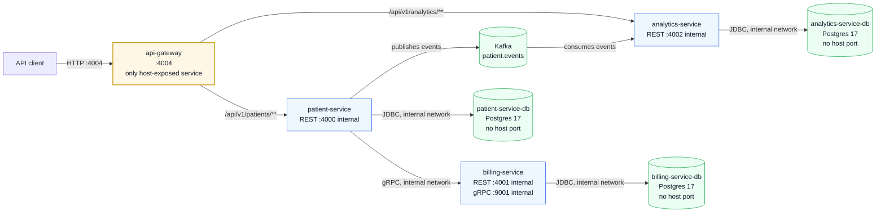

# Patient Management System

Production-oriented patient registration, billing provisioning, and analytics system built with Java 21, Spring Boot 3.5, Docker Compose, gRPC, Kafka, PostgreSQL, and Flyway.

## Architecture



The API client never reaches backend services directly — every request enters through the
gateway on `:4004`, which routes over the internal Docker network.

Database rule: service databases are private containers. They keep `ports: []` in `docker-compose.yml`, are not reachable through `localhost`, and are accessed only by service name inside the Docker network.

## Services

| Service | Responsibility | Local entrypoint |
| --- | --- | --- |
| `api-gateway` | Single HTTP entry point; routes to backend services, aggregates Swagger docs | `http://localhost:4004` |
| `patient-service` | Patient CRUD, best-effort billing provisioning, Kafka event production, reconciliation | internal (`:4000`) |
| `billing-service` | Billing account provisioning and lifecycle over gRPC | internal (`:4001`, gRPC `:9001`) |
| `analytics-service` | Kafka consumer and counts-only patient registration metrics API | internal (`:4002`) |

## Runtime

| Component | Host access | Notes |
| --- | --- | --- |
| API Gateway | `4004` | The only HTTP entry point; backends are internal Docker-network services |
| Billing gRPC | None | Used internally by `patient-service` over the Docker network |
| Kafka | `9094` | Docker clients use `kafka:9092`; IDE/local clients use `localhost:9094` |
| Postgres databases | None | Database-per-service, internal Docker network only |

## Tech Stack

| Layer | Technology |
| --- | --- |
| Language | Java 21 |
| Framework | Spring Boot 3.5 |
| Data | PostgreSQL 17, Flyway |
| Sync communication | gRPC, protobuf |
| Async communication | Apache Kafka in KRaft mode |
| API docs | SpringDoc OpenAPI / Swagger UI |
| Testing | JUnit 5, Mockito, Testcontainers |
| Containers | Docker, Docker Compose |
| Production target | AWS ECS or EKS |

## Quick Start

### 1. Configure environment

```bash
cp .env.example .env
```

Required values:

```env
PATIENT_SERVICE_DB_USER=admin_user
PATIENT_SERVICE_DB_PASSWORD=password
PATIENT_SERVICE_DB_NAME=patient_db

BILLING_SERVICE_DB_USER=admin_user
BILLING_SERVICE_DB_PASSWORD=password
BILLING_SERVICE_DB_NAME=billing_db

ANALYTICS_SERVICE_DB_USER=analytics_user
ANALYTICS_SERVICE_DB_PASSWORD=password
ANALYTICS_SERVICE_DB_NAME=analytics_db

BILLING_SERVICE_ADDRESS=billing-service
SPRING_KAFKA_BOOTSTRAP_SERVERS=kafka:9092
```

Do not add database host port variables. The services connect to their databases through Docker DNS on the internal network.

### 2. Start the stack

```bash
docker compose up --build -d
```

This starts four Spring Boot services (gateway + three backends), three private PostgreSQL databases, and Kafka.

### 3. Check health

```bash
curl http://localhost:4004/actuator/health
```

(Backend healthchecks run inside the Docker network; only the gateway is host-exposed.)

## API Surface

All requests go through the gateway — same paths as the backends, port `4004`.
Sample requests live in [`api-requests/api-gateway/all-endpoints.http`](api-requests/api-gateway/all-endpoints.http).

### Aggregated Swagger UI

**[http://localhost:4004/swagger-ui.html](http://localhost:4004/swagger-ui.html)** — one page;
a dropdown switches between patient-service and analytics-service specs (proxied via the
`/api-docs/*` gateway routes).

### Patient Service (via gateway)

| Method | Path through gateway | Description |
| --- | --- | --- |
| `POST` | `/api/v1/patients` | Register a patient and attempt billing provisioning |
| `GET` | `/api/v1/patients` | List patients |
| `GET` | `/api/v1/patients/{id}` | Get patient by ID |
| `PUT` | `/api/v1/patients/{id}` | Update patient |
| `DELETE` | `/api/v1/patients/{id}` | Delete patient |

### Analytics Service (via gateway)

| Method | Path through gateway | Description |
| --- | --- | --- |
| `GET` | `/api/v1/analytics/patients/total` | Lifetime counts by event type |
| `GET` | `/api/v1/analytics/patients/total?since=2026-08-01` | Counts from a date |
| `GET` | `/api/v1/analytics/patients/by-day` | Per-day counts, default last 30 days |
| `GET` | `/api/v1/analytics/patients/by-day?from=2026-08-01&to=2026-08-20` | Per-day counts for a custom window |

## Port Exposure Policy

Why some containers have host port bindings and others don't — and why that changed over time.

### Pre-gateway (historical)

Before the gateway existed, every service published its own host port so a developer could reach
each one directly:

| Container | Then-host ports | Now |
| --- | --- | --- |
| patient-service | `4000` | removed — internal only |
| billing-service | `4001`, gRPC `9001` | removed — internal only |
| analytics-service | `4002` | removed — internal only |
| databases (all) | never published | unchanged |
| Kafka | `9092`, `9094` | kept — IDE escape hatch (host-run apps need `localhost:9094`) |

That was fine while the fleet was small and there was no single front door.

### Post-gateway (current)

With `api-gateway` on `:4004`, the standard is **one ingress point**:

- Only the gateway publishes an HTTP port. All client traffic — humans, tests, future frontends —
  enters through `:4004`, and the gateway routes to backends over the internal Docker network.
- Backend services have **no host bindings**: they are reachable only from inside the Docker network,
  which removes a whole class of direct-access attack surface and makes the gateway the single place
  where cross-cutting concerns (auth, rate limiting, logging) will live.
- This mirrors production: a cloud load balancer / API gateway is public; ECS tasks behind it are not.

### The debugging exception

If you ever need to hit a backend directly from the host (deep debugging), temporarily re-add its
port binding in `docker-compose.yml`, restart that service, debug, then remove it again. Do not
leave debug ports committed.

### Billing note

`billing-service` has no HTTP surface at all (gRPC only), so it intentionally has no gateway route —
gateways route HTTP; internal server-to-server gRPC (patient → billing) stays on the Docker network.

## Testing

Each service owns its test suite and uses Testcontainers for database-backed tests.

All services follow the same three-layer test split:

- **Wire-layer slices** (`@WebMvcTest` for REST, pure-Mockito for gRPC) — routing, status codes, and JSON wire shapes in sub-second runs with no Docker
- **Pure-Mockito service tests** — business logic (e.g. billing provisioning branches) with all collaborators mocked, milliseconds per case
- **Testcontainers smokes** — a minimal number of real-Postgres tests proving only that layers are wired and rows actually persist (including soft-delete hiding)

```bash
cd patient-service
mvn test

cd ../billing-service
mvn test

cd ../analytics-service
mvn test
```

## Project Structure

```text
patient-management-system/
|-- patient-service/       # Patient CRUD, billing client, Kafka producer, reconciler
|-- billing-service/       # Billing provisioning gRPC service
|-- analytics-service/     # Kafka consumer and metrics REST API
|-- api-requests/          # Sample HTTP requests
|-- grpc-requests/         # Sample gRPC requests
|-- docker-compose.yml     # Local runtime: services, Kafka, private DBs
|-- .env.example           # Environment template
`-- README.md
```
