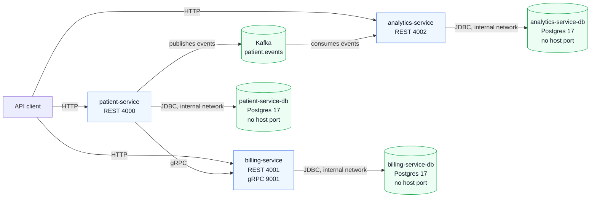

# Patient Management System

Production-oriented patient registration, billing provisioning, and analytics system built with Java 21, Spring Boot 3.5, Docker Compose, gRPC, Kafka, PostgreSQL, and Flyway.

Tutorial: [Build & Deploy a Production-Ready Patient Management System with Microservices](https://www.youtube.com/watch?v=tseqdcFfTUY)

## Architecture



Database rule: service databases are private containers. They keep `ports: []` in `docker-compose.yml`, are not reachable through `localhost`, and are accessed only by service name inside the Docker network.

## Services

| Service | Responsibility | Local entrypoint |
| --- | --- | --- |
| `patient-service` | Patient CRUD, best-effort billing provisioning, Kafka event production, reconciliation | `http://localhost:4000` |
| `billing-service` | Billing account provisioning and lifecycle over gRPC | `http://localhost:4001`, `grpc://localhost:9001` |
| `analytics-service` | Kafka consumer and counts-only patient registration metrics API | `http://localhost:4002` |

## Runtime

| Component | Host access | Notes |
| --- | --- | --- |
| Application APIs | `4000`, `4001`, `4002` | Local development only |
| Billing gRPC | `9001` | Used by `patient-service` |
| Kafka | `9094` | Docker clients use `kafka:9092`; IDE/local clients use `localhost:9094` |
| Postgres databases | None | Database-per-service, internal Docker network only |

## Tech Stack

| Layer | Technology |
| --- | --- |
| Language | Java 21 |
| Framework | Spring Boot 3.5 |
| Data | PostgreSQL 17, Flyway |
| Sync communication | gRPC, protobuf |
| Async communication | Apache Kafka in KRaft mode |
| API docs | SpringDoc OpenAPI / Swagger UI |
| Testing | JUnit 5, Mockito, Testcontainers |
| Containers | Docker, Docker Compose |
| Production target | AWS ECS or EKS |

## Quick Start

### 1. Configure environment

```bash
cp .env.example .env
```

Required values:

```env
PATIENT_SERVICE_DB_USER=admin_user
PATIENT_SERVICE_DB_PASSWORD=password
PATIENT_SERVICE_DB_NAME=patient_db

BILLING_SERVICE_DB_USER=admin_user
BILLING_SERVICE_DB_PASSWORD=password
BILLING_SERVICE_DB_NAME=billing_db

ANALYTICS_SERVICE_DB_USER=analytics_user
ANALYTICS_SERVICE_DB_PASSWORD=password
ANALYTICS_SERVICE_DB_NAME=analytics_db

BILLING_SERVICE_ADDRESS=billing-service
SPRING_KAFKA_BOOTSTRAP_SERVERS=kafka:9092
```

Do not add database host port variables. The services connect to their databases through Docker DNS on the internal network.

### 2. Start the stack

```bash
docker compose up --build -d
```

This starts three Spring Boot services, three private PostgreSQL databases, and Kafka.

### 3. Check health

```bash
curl http://localhost:4000/actuator/health
curl http://localhost:4001/actuator/health
curl http://localhost:4002/actuator/health
```

## API Surface

### Patient Service

| Method | Path | Description |
| --- | --- | --- |
| `POST` | `/api/v1/patients` | Register a patient and attempt billing provisioning |
| `GET` | `/api/v1/patients` | List patients |
| `GET` | `/api/v1/patients/{id}` | Get patient by ID |
| `PUT` | `/api/v1/patients/{id}` | Update patient |
| `DELETE` | `/api/v1/patients/{id}` | Delete patient |

Swagger UI: [http://localhost:4000/swagger-ui.html](http://localhost:4000/swagger-ui.html)

### Analytics Service

| Method | Path | Description |
| --- | --- | --- |
| `GET` | `/api/v1/analytics/patients/total` | Lifetime counts by event type |
| `GET` | `/api/v1/analytics/patients/total?since=2026-08-01` | Counts from a date |
| `GET` | `/api/v1/analytics/patients/by-day` | Per-day counts, default last 30 days |
| `GET` | `/api/v1/analytics/patients/by-day?from=2026-08-01&to=2026-08-20` | Per-day counts for a custom window |

Swagger UI: [http://localhost:4002/swagger-ui.html](http://localhost:4002/swagger-ui.html)

## Testing

Each service owns its test suite and uses Testcontainers for database-backed tests.

All services follow the same three-layer test split:

- **Wire-layer slices** (`@WebMvcTest` for REST, pure-Mockito for gRPC) — routing, status codes, and JSON wire shapes in sub-second runs with no Docker
- **Pure-Mockito service tests** — business logic (e.g. billing provisioning branches) with all collaborators mocked, milliseconds per case
- **Testcontainers smokes** — a minimal number of real-Postgres tests proving only that layers are wired and rows actually persist (including soft-delete hiding)

```bash
cd patient-service
mvn test

cd ../billing-service
mvn test

cd ../analytics-service
mvn test
```

## Project Structure

```text
patient-management-system/
|-- patient-service/       # Patient CRUD, billing client, Kafka producer, reconciler
|-- billing-service/       # Billing provisioning gRPC service
|-- analytics-service/     # Kafka consumer and metrics REST API
|-- api-requests/          # Sample HTTP requests
|-- grpc-requests/         # Sample gRPC requests
|-- docker-compose.yml     # Local runtime: services, Kafka, private DBs
|-- .env.example           # Environment template
`-- README.md
```
